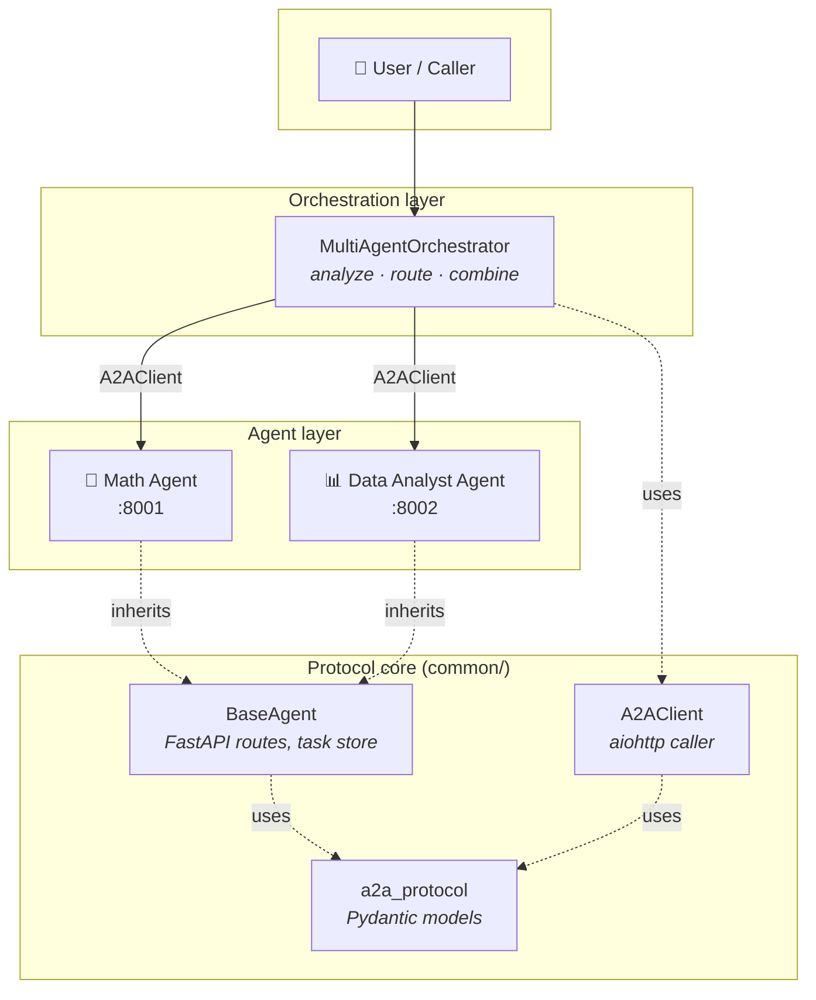
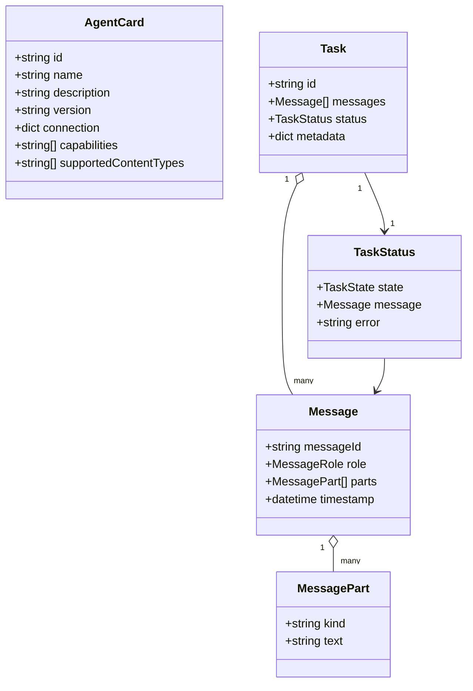
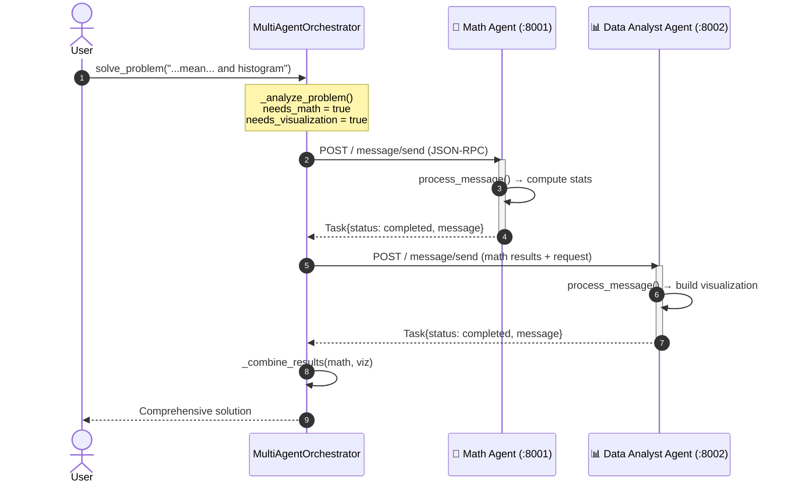
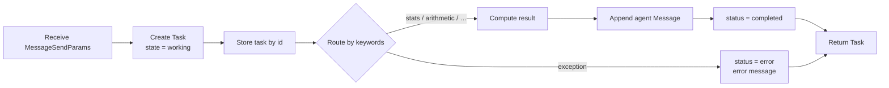

# 🏗️ Architecture

This document describes how the **A2A (Agent-to-Agent) protocol** demo is put
together: the protocol, the component layers, the runtime message flow, and how
to extend the system with your own agents.

> For a quick overview and how to run it, see the [README](README.md).
> A rendered, visual version of this document is published on the
> [project site](https://rrahimi-uci.github.io/a2a-poc/).

---

## 1. Design goals

| Goal | How it's met |
|------|--------------|
| **Interoperable** | Plain HTTP + JSON-RPC 2.0 — any language/framework can speak it |
| **Discoverable** | Each agent advertises an *Agent Card* at `/` and `/.well-known/agent.json` |
| **Composable** | An orchestrator routes work to specialized agents and merges results |
| **Readable** | Small, typed (Pydantic) models; one class per responsibility |
| **Testable** | Agents are plain FastAPI apps — exercised in-process with `TestClient` |

---

## 2. Component layers



| Layer | Module(s) | Responsibility |
|-------|-----------|----------------|
| **Protocol core** | [`common/a2a_protocol.py`](common/a2a_protocol.py) | Typed message/task/card models + JSON-RPC envelopes & error codes |
| **Base agent** | [`common/base_agent.py`](common/base_agent.py) | `BaseAgent` (server: routes, task store, dispatch) and `A2AClient` (client) |
| **Specialized agents** | [`agents/`](agents/) | `MathAgent`, `DataAnalystAgent` — implement `process_message()` |
| **Orchestration** | [`examples/orchestrator.py`](examples/orchestrator.py) | Analyze a problem, route to the right agent(s), combine answers |
| **Entry points** | [`scripts/`](scripts/) | Start agents, run the demo, launch the whole system |

---

## 3. The A2A protocol

### Transport & envelope

- **Transport:** HTTP `POST /`
- **Envelope:** [JSON-RPC 2.0](https://www.jsonrpc.org/specification)
- **Methods:** `message/send` (do work, return a `Task`), `task/get` (fetch a stored task)

### Core data model



`TaskState` is one of `pending · working · completed · error · input_required`.

### Discovery — the Agent Card

Every agent answers `GET /` (and the conventional `GET /.well-known/agent.json`)
with a card describing what it can do, so callers can discover capabilities at
runtime instead of hard-coding them:

```json
{
  "id": "math-agent-001",
  "name": "Math Agent",
  "description": "Specialized agent for mathematical computations …",
  "version": "1.0.0",
  "connection": { "url": "http://localhost:8001", "method": "http", "version": "1.0" },
  "capabilities": ["arithmetic_operations", "statistical_analysis", "linear_algebra", "probability_distributions"],
  "supportedContentTypes": ["text/plain", "application/json"]
}
```

A `GET /health` endpoint is also provided for liveness checks.

### Error codes

Standard JSON-RPC codes plus A2A-specific ones (see
[`ErrorCodes`](common/a2a_protocol.py)):

| Code | Meaning |
|------|---------|
| `-32601` | Method not found |
| `-32602` | Invalid params (e.g. unknown task id) |
| `-32603` | Internal error |
| `-32001` | Agent unavailable |
| `-32002` | Task failed |
| `-32003` | Communication error |

---

## 4. Runtime flow

A request like *"Calculate the mean of `[12,15,18,20]` and create a histogram"*
flows through the system as follows:



### Inside an agent: `process_message()`



The orchestrator's routing is intentionally simple — **keyword matching** in
`_analyze_problem()`. This keeps the demo transparent; in a production system
you'd likely swap in an LLM-based router or capability negotiation driven by
the Agent Cards.

---

## 5. Extending the system

Adding a new agent is three steps:

**1. Subclass `BaseAgent`** and declare capabilities:

```python
from common.base_agent import BaseAgent

class NLPAgent(BaseAgent):
    def __init__(self, port: int = 8003):
        super().__init__(
            agent_id="nlp-agent-001",
            name="NLP Agent",
            description="Sentiment analysis and text summarization.",
            port=port,
            capabilities=["sentiment_analysis", "summarization"],
        )
```

**2. Implement `process_message()`** — parse the incoming `Message`, do the
work, and return a `Task` whose `status` is `completed` (or `error`). The base
class already wires up the HTTP routes, JSON-RPC dispatch, Agent Card, health
check, and task storage.

**3. Register it with the orchestrator** (add a URL + routing keywords), or call
it directly with `A2AClient`:

```python
from common.base_agent import A2AClient
from common.a2a_protocol import Message, MessagePart, MessageRole

client = A2AClient()
msg = Message(role=MessageRole.USER, parts=[MessagePart(text="summarize: …")])
task = await client.send_message("http://localhost:8003", msg)
print(task.status.message.parts[0].text)
```

Add a `scripts/start_nlp_agent.py` entry point (mirroring the existing ones) and
a test module under `tests/`, and you're done.

---

## 6. Why JSON-RPC over HTTP?

- **Ubiquitous** — every platform has an HTTP client and a JSON parser.
- **Framework-agnostic** — an A2A agent and an AutoGen/LangChain/CrewAI agent
  can interoperate through the same envelope (see [`examples/`](examples/)).
- **Debuggable** — you can drive any agent with a single `curl` command.
- **Stateless requests, stateful tasks** — each call is self-contained, while
  `task/get` lets callers poll long-running work by id.

---

## 7. Limitations & next steps

This is a teaching-oriented reference, not a hardened service. Natural
extensions:

- **Streaming / SSE** for incremental task updates (`working` → … → `completed`).
- **Authentication** and per-agent authorization.
- **Real image transport** — the Data Analyst currently returns chart
  *descriptions*; encode and return PNG bytes via an `image/png` part.
- **LLM-based routing** in place of keyword matching.
- **Containerization** (Docker/Kubernetes) for multi-host deployments.
